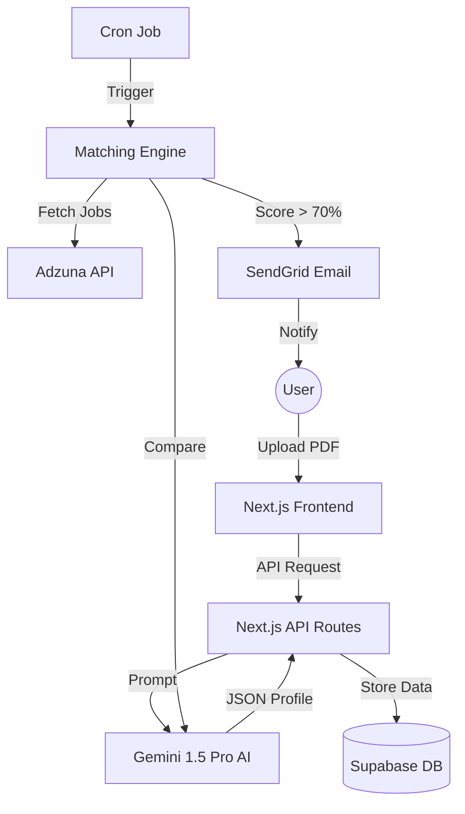

# BestMatch


## 📊 Evaluation Dashboard

| Metric                | Status                                                                                                                                           | Tool             |
| :-------------------- | :----------------------------------------------------------------------------------------------------------------------------------------------- | :--------------- |
| **Build & CI**        |                          | GitHub Actions   |
| **Test Coverage**     |                                          | Vitest & Codecov |
| **Security Scanning** |  | GitHub CodeQL    |
| **Code Quality**      |                                                                           | ESLint           |

---

## 1. Project Overview & Value Proposition

**BestMatch** is an AI-driven job matching dashboard designed to eliminate "search fatigue" for job seekers. Instead of manually scanning dozens of job boards and tailoring resumes for every application, users upload one **Master Resume**, and our system continuously scans and matches roles to their unique profile.

### Core Features

- **AI Resume Persona Extraction**: Automatically parses PDF resumes to extract skills, experience levels, and professional tags using Gemini 1.5 Pro.
- **Intelligent Match Scoring**: Compares job descriptions against user profiles to calculate a match percentage, delivering only high-probability roles (>70% score).
- **Automated Email Delivery**: Delivers a curated inbox of opportunities at user-defined intervals (Daily/Weekly) via SendGrid.
- **Preference-Driven Filtering**: Users can define target locations and matching frequency to ensure relevance.

**Deployed app**: [bestmatch.page](https://www.bestmatch.page/)

---

## 2. Technical Stack & Architecture

We utilized a robust, AI-friendly stack to ensure type safety, scalability, and rapid development.

- **Frontend**: Next.js 15 (App Router), React 19, Tailwind CSS v4, Shadcn UI, Framer Motion.
- **Backend**: Next.js API Routes (Full-stack TypeScript framework) with Zod for schema validation.
- **Database & Auth**: Supabase (PostgreSQL + Magic Link Auth).
- **AI Engine**: Google Gemini 1.5 Pro for resume parsing and matching logic.
- **CI/CD**: GitHub Actions for automated linting, testing, security scanning, and Vercel for deployment.

### System Architecture



---

## 3. AI Mastery & Human-AI Collaboration

This project was developed using an "AI-Centric" workflow, leveraging multiple AI agents to maximize productivity and code quality.

- **Collaborative Architecture**: Used **Claude 3.5 Sonnet** (Web) for high-level architectural design, logic explanation, and complex problem-solving.
- **IDE-Centric implementation**: Utilized **Antigravity/Cursor** for context-aware code generation, refactoring, and automated test writing.
- **Prompt Engineering**: Employed structured, multi-shot prompting for Gemini 1.5 Pro to ensure consistent JSON extraction from diverse resume formats.

> [!NOTE]
> Detailed Prompt strategies and developer logs are documented in the [CS7180 Project2 Deliverables SharePoint Doc](https://northeastern-my.sharepoint.com/:w:/r/personal/zixin_l_northeastern_edu/_layouts/15/Doc.aspx?sourcedoc=%7B610E361A-10A0-4318-9832-F3BEB4000329%7D&file=Document%202.docx&action=editNew&mobileredirect=true) and [docs/AI_MASTERY.md](docs/AI_MASTERY.md).

---

## 4. Automation & Quality Assurance (CI/CD)

We adhere to a mandatory **>80% test coverage** policy to ensure the reliability of our critical matching logic and user flows.

### Testing Strategy

- **Unit & Integration**: Vitest for API routes and core matching logic.
- **End-to-End (E2E)**: Playwright for critical user paths (Onboarding -> Dashboard).
- **Coverage**: Tracked via Codecov integration.

### Run Tests Locally

```bash
# Unit & Integration Tests
npm run test:coverage

# E2E Tests
npm run test:e2e
```

### CI/CD Pipeline

Our GitHub Actions workflow handles:

1. **Lint & Format**: Prettier and ESLint check for style consistency.
2. **Security Scan**: GitHub CodeQL scans for vulnerabilities.
3. **Automated Testing**: Runs the full test suite and uploads coverage to Codecov.
4. **Deploy**: Automatic deployment to Vercel on successful quality gate completion.

---

## 5. Agile Process & Sprint Records

The development was executed in two intensive Sprints following Agile methodologies.

### Sprint 1: Infrastructure & Core Onboarding

- **Focus**: Project scaffolding, Auth integration, and AI Resume Parsing.
- **Key Deliverables**: PDF extraction engine, Supabase schema, Magic Link sign-in, and Onboarding UI.
- **Roles**: Zixin Lin (Frontend Lead) & Yun Feng (Backend & AI Lead).

### Sprint 2: Dashboard & Matching Engine

- **Focus**: User features, Job Matching algorithm, and Automated Notifications.
- **Key Deliverables**: Dashboard Profile Management, Job fetching module, AI Scoring logic (Zod validated), and SendGrid integration.
- **Roles**: Zixin Lin (Frontend Lead) & Yun Feng (Backend & AI Lead).

> [!TIP]
> **Sprint Documentation**:
>
> - [Sprint Planning & Retrospectives](https://northeastern-my.sharepoint.com/:w:/r/personal/zixin_l_northeastern_edu/_layouts/15/Doc.aspx?sourcedoc=%7B610E361A-10A0-4318-9832-F3BEB4000329%7D&file=Document%202.docx&action=editNew&mobileredirect=true) / [docs/SPRINT_RECORDS.md](docs/SPRINT_RECORDS.md)

---

## 6. Getting Started

Follow these steps to set up the project locally.

### Prerequisites

- Node.js 20+
- A Supabase account and project.
- A Gemini AI API Key.

### Environment Variables

Create a `.env.local` file based on `.env.example`:

```env
NEXT_PUBLIC_SUPABASE_URL=your_supabase_url
NEXT_PUBLIC_SUPABASE_ANON_KEY=your_supabase_anon_key
GEMINI_API_KEY=your_gemini_api_key
SENDGRID_API_KEY=your_sendgrid_key
ADZUNA_APP_ID=your_adzuna_id
ADZUNA_APP_KEY=your_adzuna_key
```

### Installation & Run

1. **Install Dependencies**: `npm install`
2. **Run Development Server**: `npm run dev`
3. **Build Prod**: `npm run build`

---

## 7. Resource Appendix

- **API Documentation**: [SharePoint Doc](https://northeastern-my.sharepoint.com/:w:/r/personal/zixin_l_northeastern_edu/_layouts/15/Doc.aspx?sourcedoc=%7B610E361A-10A0-4318-9832-F3BEB4000329%7D&file=Document%202.docx&action=editNew&mobileredirect=true)
- **Technical Blog Post**: [SharePoint Doc](https://northeastern-my.sharepoint.com/:w:/r/personal/zixin_l_northeastern_edu/_layouts/15/Doc.aspx?sourcedoc=%7B610E361A-10A0-4318-9832-F3BEB4000329%7D&file=Document%202.docx&action=editNew&mobileredirect=true) | [TECHNICAL_BLOG.md](docs/TECHNICAL_BLOG.md)
- **AI Mastery & Collaborative Workflow**: [docs/AI_MASTERY.md](docs/AI_MASTERY.md)
- **Sprint Records & Process**: [docs/SPRINT_RECORDS.md](docs/SPRINT_RECORDS.md)
- **Video Demo**: [YouTube Demo](https://www.youtube.com/watch?v=kNPfi2f71IU)
